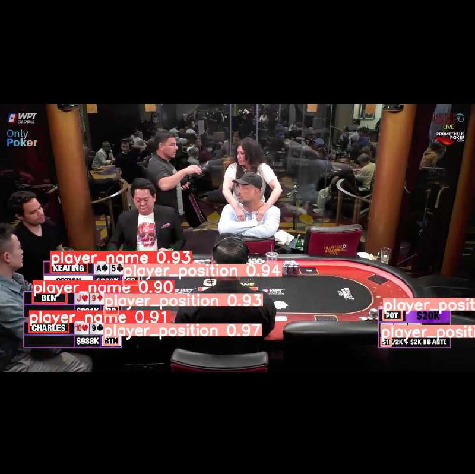

# OCR-YOLOv8 Project

## Overview

This project is focused on Optical Character Recognition (OCR) using the YOLOv8 architecture. YOLOv8 is a deep learning model designed for object detection, and in this case, it is adapted for text recognition within images. The project involves training and inference on images, and the data used for training and testing is stored in the `data/` folder.

### Example:

 

<p align="center">
  
  
<!-- <!--    -->
<!--    --> -->
</p>

## Project Structure

- **data/**: Contains the image data used for OCR processing.
- **models/**: Contains model-related scripts and utilities for text recognition.
  - `detection_model.py`: Defines the YOLOv8 model for text detection.
  - `trocr_processing.py`: Processes images for OCR tasks.
  - `utils.py`: Utility functions for image preprocessing and post-processing.
- **main.py**: The main entry point for running OCR on input images using YOLOv8.
- **requirements.txt**: Lists the Python dependencies required for the project.

## Installation

To get started with this project, you'll need to install the required dependencies. You can do this by running the following command:

```bash
pip install -r requirements.txt


